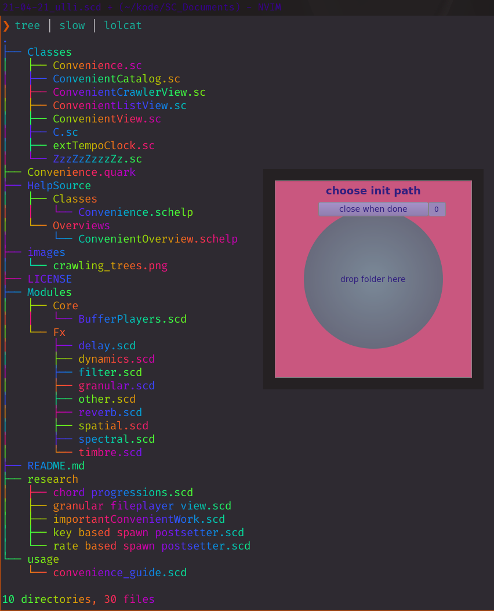

# Convenience
Convenience is many things but first and foremost it is convenient for me.

But if you like to **ease** - read on.



Convenience is a tool to easily load audio files into easily accessible collections of buffers in SuperCollider. 

It is a tool to easily play these buffers.

It is a great tool for discovering surprising audio file mixtures.

Convenience has a crawler method that can recursively go through a directory tree. And load buffers catalogued together in keys related to their placement in the tree.

It can sequence between folders and files, while controlling playback position, pitch/rate, amplitude, chaining of effects and control fx parameters and more.
Several Convenience sequencer/pattern instances can run side by side, as independent tracks.

It is Pattern Class based so you can do your usual pattern grub but with obvious limitations in regard to the more demanding Pattern Class usages.

It can load and remove buffer groups (folders of audio files) while playing.

Convenience is a good friend of nvme disks and lots of ram.

This Class is a work in progress. It is unstable. It can change in ways where saved usage of the Class does not function any more.

## Convenience is (trying to be)
at ease, comfortable, leisurely, spontaneous, loose and forthright.

It is plain sailing and easy as pie.

## Installation
clone this repository to your `Platform.userExtensionDir`

or

In SuperCollider, evaluate the following code to install it as a Quark: 

```supercollider
Quarks.install("https://github.com/salkin-mada/Convenience.git")
```

## Brief note on usage

* `Convenience.crawl`

Opens a window where you can drag and drop folders + control "loading depth" i.e. recursive steps into/along a directory tree.

* `Convenience.crawl(path, depth)`

Start crawling immediately from given path into its tree

Both creates a dict of `Buffer`'s loaded with the audio files from the folders found in the given directory tree (path). 
(please note that Convenience will load mono and stereo samples. If a given sound file has 3 or more channels. Channel[0] will be loaded.

Each folder's contents are accessible as an array of buffers at a dict key based on the folder name formatted into a usable key (name/id).

* `Convenience.p(\name)`

Create and start a convenient sequencer, giving it a name is the minimum requirement

* `Convenience.properties`

List all arguments available in the .p method

* `Convenience.get(folder, index)`

Returns the `Buffer` of file at index in chosen folder - if queried index is to high it will wrap around the size of files in the chosen folder until it finds an existing index. Also if chosen folder does not exist it will default to first one in the dictionary of loaded folders.
No need to worry about asking for a file number or folder key which is not there.
This is true for both the `.get` and `.p` method.

* For the keyboard-centric folks `C` and `ZzzZzZzzzZz` can be used as convenient "one-handers" :)

```supercollider
s.boot;

/* crawler loads folders in its way */
C.crawl

// no gui usage
C.crawl(Platform.resourceDir +/+ "sounds", depth: 0)

C.list // get some info of what went down

//minimum
C.p('lay'); // play at the beginning of first file in first folder
C.s('lay'); // stop

// play
C.p('lay',
    tempo: 8.0,
    folder: \sounds,
    index: Prand([1,2,3], inf),
    pos: Pwhite(0.2,0.7),
    dur: Pseq([1,3,Rest(2),2], inf),
    rate: Pwhite(0.9,1.0) * Pstep([0.4,0.9,0.2], Prand([3,5,8], inf), inf),
    pan: Pwhite(-0.65,0.65),
    amp: 0.4
);
// repeat method
C.repeat('lay',0,5)

// slay
C.s('lay')
```

Convenience.p outputs stereo, 2 channels, but can be sequenced to whatever output pair and bus.
For more info about `.p` arguments check the `convenience_guide.scd` in /Convenience/usage or simply check the helpfile, `ctrl+d` / `cmd+d` / `K` / `<A>-h` depending on your OS and IDE.

